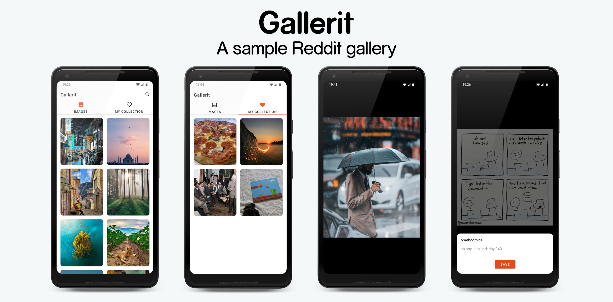

# Gallerit

[](https://kotlinlang.org)
[](https://developer.android.com/studio/releases/gradle-plugin)
[](https://gradle.org)

[](https://mailchi.mp/kotlinweekly/kotlin-weekly-211)

<b>Gallerit</b> is a small demo application that presents a modern approach to Android development with up to date tech-stack. The goal of the project is to demonstrate best practices using modern Android development tools and presenting an architecture that is scalable, maintainable, and testable.

## Project characteristics

- 100% [Kotlin](https://kotlinlang.org/)
- Model-View-ViewModel
- Repository Pattern
- A single activity architecture
- [Android Jetpack](https://developer.android.com/jetpack)
- Reactive UI
- Testing
- Dependency Injection
- [Gradle Kotlin DSL](https://docs.gradle.org/current/userguide/kotlin_dsl.html)
- Material Design
- [GitHub Actions](https://github.com/features/actions)

## Libraries

- [Coroutines](https://kotlinlang.org/docs/reference/coroutines-overview.html) - For managing background threads.
- [Flow](https://kotlin.github.io/kotlinx.coroutines/kotlinx-coroutines-core/kotlinx.coroutines.flow/-flow/) - A cold asynchronous data stream that sequentially emits values.
- [StateFlow](https://kotlin.github.io/kotlinx.coroutines/kotlinx-coroutines-core/kotlinx.coroutines.flow/-state-flow/) - A Flow that represents a state with a single updatable data value.
- Jetpack
  - [ViewModel](https://developer.android.com/topic/libraries/architecture/viewmodel) - Store UI-related data that isn't destroyed on app rotations.
  - [LiveData](https://developer.android.com/topic/libraries/architecture/livedata) - Build data objects that notify views when the underlying database changes.
  - [Lifecycle](https://developer.android.com/topic/libraries/architecture/lifecycle) - Create a UI that automatically responds to lifecycle events.
  - [Navigation](https://developer.android.com/guide/navigation) - Handle everything needed for in-app navigation.
  - [Room](https://developer.android.com/topic/libraries/architecture/room) - Access your app's SQLite database with in-app objects and compile-time checks.
- [Retrofit2](https://square.github.io/retrofit/) - A type-safe HTTP client.
- [Glide](https://bumptech.github.io/glide/) - An image loading and caching library.
- [PhotoView](https://github.com/chrisbanes/PhotoView) - Implementation of ImageView that supports zooming.
- [Koin](https://insert-koin.io/) - A pragmatic lightweight dependency injection framework.
- [Timber](https://github.com/JakeWharton/timber) - A logger with a small, extensible API.
- [MockK](https://mockk.io/) - Mocking library for Kotlin.
- [Kotest](https://github.com/kotest/kotest) - Powerful, elegant and flexible test framework for Kotlin.
- [and more...](buildSrc/src/main/java/Dependencies.kt)

## Architecture

Gallerit is based on [MVVM](https://developer.android.com/jetpack/guide#recommended-app-arch) architecture, fetching data from the network and integrating persisted data in the database via repository pattern.


## Reddit API

Gallerit uses the [Reddit API](https://www.reddit.com/dev/api/) to load images on the gallery screen.

## GitHub Actions

[GitHub Actions](https://github.com/auron567/Gallerit/actions) verify project correctness on every push to `master` branch and on every PR. All of the tasks run in parallel.

These are all of the Gradle tasks that are [workflows](https://github.com/auron567/Gallerit/tree/master/.github/workflows):

- `./gradlew test` - Run unit tests
- `./gradlew ktlintCheck` - Run ktlint check
- `./gradlew assembleDebug` - Build debug APK

## Getting started

There are a few ways to open this project.

<b>Android Studio</b>

1. Android Studio -> File -> New -> Project from Version Control
2. Enter `https://github.com/auron567/Gallerit.git` into URL field

<b>Command line + Android Studio</b>

1. Run `git clone https://github.com/auron567/Gallerit.git`
2. Android Studio -> File -> Open

## Contribute

If you want to contribute to this application, you're always welcome! You can contribute by filing issues, bugs and PRs.

## License

All the code available under the MIT License. See [LICENSE](LICENSE).

```
MIT License

Copyright (c) 2020 Mario Salvatore

Permission is hereby granted, free of charge, to any person obtaining a copy
of this software and associated documentation files (the "Software"), to deal
in the Software without restriction, including without limitation the rights
to use, copy, modify, merge, publish, distribute, sublicense, and/or sell
copies of the Software, and to permit persons to whom the Software is
furnished to do so, subject to the following conditions:

The above copyright notice and this permission notice shall be included in all
copies or substantial portions of the Software.

THE SOFTWARE IS PROVIDED "AS IS", WITHOUT WARRANTY OF ANY KIND, EXPRESS OR
IMPLIED, INCLUDING BUT NOT LIMITED TO THE WARRANTIES OF MERCHANTABILITY,
FITNESS FOR A PARTICULAR PURPOSE AND NONINFRINGEMENT. IN NO EVENT SHALL THE
AUTHORS OR COPYRIGHT HOLDERS BE LIABLE FOR ANY CLAIM, DAMAGES OR OTHER
LIABILITY, WHETHER IN AN ACTION OF CONTRACT, TORT OR OTHERWISE, ARISING FROM,
OUT OF OR IN CONNECTION WITH THE SOFTWARE OR THE USE OR OTHER DEALINGS IN THE
SOFTWARE.
```
